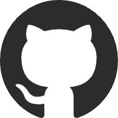

  
  <h2>基本信息</h2>

<table width="100%">
  <tr>
    <td width="70%">
      

        
        <strong>CozyOct1</strong>
      

      

        
        <strong>23 岁</strong>
      

      

        
        <strong>浙江省杭州市</strong>
      

      

        
        <strong>15551651895</strong>
      

      

        
        <strong>nwj_zju@foxmail.com</strong>
      

    </td>
    <td width="30%" align="right">
      <!-- 证件照位置 -->
      
    </td>
  </tr>
</table>

 

  
  <h2>教育背景</h2>

<table width="100%">
  <tr>
    <td>
      

        
        <strong>合肥工业大学 | 智能科学与技术 | 本科</strong>
      

    </td>
    <td align="right"><strong>2020.09 - 2024.06</strong></td>
  </tr>
  <tr>
    <td>
      

        
        <strong>浙江大学 | 人工智能 | 硕士</strong>
      

    </td>
    <td align="right"><strong>2024.09 - 2027.06</strong></td>
  </tr>
</table>

 

  
  <h2>实习经历</h2>

<table width="100%">
  <tr>
    <td>
      

        
        <strong>上海哔哩哔哩股份有限公司 | 大模型&AIGC 研发工程师 | 数码推荐</strong>
      

    </td>
    <td align="right"><strong>2025.05 - 2025.08</strong></td>
  </tr>
</table>

LLMRAGMilvus

**项目职责：** 负责出卡判断服务的维护以及数码推荐服务和检索召回服务的优化

**项目介绍：**

1. **出卡判断服务**

   - **功能：**  
     实时判断用户搜索是否符合展示数码推荐卡片条件。
   - **流程：**
     - 接收主搜接口请求，分析用户查询。
     - 基于预定义的数码行业关键词库（描述、品牌、功能、价格、评测等）构建正则规则引擎进行匹配与评分。
     - **决策逻辑：** 评分 ≥ 0.7 且命中强相关关键词，则触发展示带有可变标题的数码推荐卡片。

2. **数码推荐服务**

   - **功能：**  
     提供可变标题展示、用户聊天交互、服务停止控制、历史记录管理（标题/聊天）、用户赞踩反馈、具体反馈收集等接口。
   - **流程：**
     - **Query 审核：** 对用户 Query 进行敏感词过滤 + AI 机审。
     - **Query 改写：** 通过审核后，进行问题类型判断与数码 Query 规范化改写。
     - **数码问题：**  
       调用检索召回服务 → 进行意图识别 → 根据召回结果和意图，分三种情况（检索为空 + 直接推荐 + 意图下钻）调用大模型生成不同的回答。
     - **非数码问题：**  
       直接调用大模型生成普通对话回答。
     - **结果审核：** 对大模型生成的回答进行敏感词过滤 + AI 机审。

3. **检索召回服务**

   - **功能：**  
     基于 Milvus 向量数据库以及重排模型，为推荐服务提供精准、多样化的信息召回。
   - **流程：**
     - **意图识别：** 根据 Query 判断检索信息的类型，以及对 Query 中的 Sku 相关信息进行提取和分类。
     - **Query 分析：** 提取正负向品牌，拆分子查询并改写主查询。
     - **型号标准化：** 对 Query 中的 Sku 相关信息进行模糊型号（时效、参数、品牌、热度）和具体型号的标准化处理。
     - **用户评论召回：**
       - **无 sku：** 检索评论库 → BGE 模型重排 → 聚合返回。
       - **单 sku：** 检索目标机型评论 → BGE 重排 → 调用大模型精确分类 → 聚合返回。
       - **多 sku：** 转交机型推荐服务处理。
     - **机型推荐召回：**
       - **无 sku：** 主/子查询四路召回检索 → 基于意图和型号条件过滤 → 聚合返回。
       - **有 sku：** 目标机型四路召回检索 → 聚合返回。
     - **四路召回检索：**
       - **Milvus 向量数据库集群部署：** 部署 Milvus 向量数据库集群，管理高光帧特征、ASR 文本、SKU 参数、视频章节文本等多模态数据。
       - **检索流程：** 检索结果 → 使用 Qwen3 模型进行重排 (Rerank) → 调用大模型进行内容分类、打分、筛选 → 返回优质结果。

 

  
  <h2>项目经历</h2>

<table width="100%">
  <tr>
    <td>
      

        
        <strong>智能数据分析平台</strong>
      

    </td>
    <td align="right"><strong>2025.02 - 2025.04</strong></td>
  </tr>
</table>

LLMAgentLangchain

**项目架构**

- **Planning：** 意图识别，Query 拆分
- **Memory：** 通过 Mysql 数据库存储用户的所有查询记录
- **Action：** Sql 语句查询，可视化数据报表生成，Sql 语句自动纠错
- **Tool：** Sql 执行工具，Python 执行工具

**项目流程**

- **用户查询 → 意图识别**
  - **Sql 语句查询：**  
    Query 拆分 → Sql 语句生成 → Sql 语句执行 → Sql 语句自动纠错
  - **可视化数据报表生成：**  
    Query 拆分 → Sql 语句生成 → Sql 语句执行 → Sql 语句自动纠错 → 可视化数据报表 Python 代码生成 → Python 代码执行
  - **正常对话：** LLM 正常对话

 

  
  <h2>专业技能</h2>

| | | | |
|-|-|-|-|
|||||
|||||